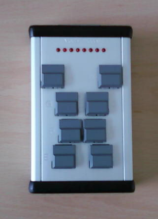

<header>
PsychoPy 5: Getting Responses
============
</header>
<main>
!SLIDE

# PsychoPy : Getting Responses
   
    Created by Jibo He, <a>drhejibo@gmail.com/a>

!SLIDE

### Table of Content
- Mouse Clicks
- Keyboard Inputs
- Capture Response Box

!SLIDE left

# Keyboard Inputs
- show text
- capture keyboard inputs

!SLIDE left

# Capture Keyboard Inputs
- show text

~~~~{python}
textString = "Press any key to continue\n"
message = visual.TextStim(win, text=textString)

~~~~

!SLIDE left

# Capture Keyboard Inputs
- event.waitKeys()

~~~~{python}
event.waitKeys()

~~~~

!SLIDE left
# display N-Back Task

~~~~{python}

#!/usr/bin/env python
# -*- coding: utf-8 -*-
# There is little experiment if the experimentee cannot give any input.
# Here we changed our assignmet 1 a bit so that it waits for a keys, rather
# than waiting 5 s. Note that we need to import the event library from
# PsychoPy to make this work.
from psychopy import core, visual, event
  
## Setup Section
win = visual.Window([400,300], monitor="testMonitor")
textString = "Press any key to continue\n"
message = visual.TextStim(win, text=textString)
 
## Experiment Section
message.draw()
win.flip()
c = event.waitKeys() # read a character
message = visual.TextStim(win, text=textString + c[0])
message.draw()
win.flip()
event.waitKeys()
 
## Closing Section
win.close()
core.quit()
~~~~

!SLIDE left
# Capture keyboard inputs

~~~~{python}
ResponseList =[]
#......

    inputs = event.waitKeys()
    print "inputs:",inputs
    ResponseList.extend(inputs)
~~~~

!SLIDE left
# log data 

~~~~{python}
outfile = open("response-n-back-task.txt",'w')
for i in ResponseList:
    print >>outfile,i
outfile.close()
~~~~

!SLIDE left
# Complete code for visual N-Back Task with Response
~~~~{python}
'''
By Jibo He @ WSU
v1.0 - Sep 16,2014
    - demostrate a visual n-back task

V1.1 - October 28, 2016
    - add response data collection.
'''

from psychopy import visual, core, event
import instructionFile
import EndOfExperimentFile
instructionFile.showInstruction('instruction.txt')

# load the data source
infile = open('datasource.csv','r')
datasource ={}
for line in infile.readlines()[1:]:
    trial,number = line.split(',')
    datasource[trial]=int(number.strip())

print datasource
infile.close()

#create a window to draw in
myWin = visual.Window((800.0,800.0),allowGUI=False,winType='pyglet',
            monitor='testMonitor', units ='deg', screen=0)
myWin.setRecordFrameIntervals()
#choose some fonts. If a list is provided, the first font found will be used.
fancy = ['Monotype Corsiva', 'Palace Script MT', 'Edwardian Script ITC']

ResponseList =[]
#INITIALISE SOME STIMULI
for trial in xrange(1,len(datasource)):
    number = visual.TextStim(myWin, color='#FFFFFF',
                            text = str(datasource[str(trial)]
                       ),
                            units='norm', height=0.1,
                            pos=[0, 0.0], alignHoriz='right',alignVert='top',
                            font=fancy)

    number.draw()
        
    myWin.flip()
    inputs = event.waitKeys()
    print "inputs:",inputs
    ResponseList.extend(inputs)

    #pause, so you get a chance to see it!
    core.wait(5.0)

outfile = open("response-n-back-task.txt",'w')
for i in ResponseList:
    print >>outfile,i
outfile.close()

EndOfExperimentFile.showInstruction('EndOfExperimentInstruction.txt')

~~~~

!SLIDE left

# Capture Mouse Clicks
- event.Mouse() 

~~~~{python}
myMouse = event.Mouse()  #  will use myWin by default

if myMouse.getPressed()[0]:
    myMouse.clickReset()
    print myMouse.getPos()

~~~~

!SLIDE left

# Capture Mouse Clicks
- see testMouseClicks.py

~~~~{python}
#!/usr/bin/env python2
from psychopy import visual, core, event
from pyglet.gl import *

width = 600
height = 600
myWin = visual.Window([width,height], color='white',units='pix',monitor='testMonitor')

#This will set the windows units (pixels) to GL units
glMatrixMode(GL_PROJECTION)
glLoadIdentity()
glOrtho(0, width, 0, height, -1, 1)

glMatrixMode(GL_MODELVIEW)
glLoadIdentity()

glEnable(GL_BLEND)
glBlendFunc(GL_ZERO, GL_SRC_COLOR)

myMouse = event.Mouse()  #  will use myWin by default

while True:
    #Triangle left
    glColor3f(1.0, 0.0, 0.0)
    glBegin(GL_TRIANGLES)
    glVertex3f(150, 550, 1)
    glVertex3f(50, 350, 1)
    glVertex3f(250, 350, -1)
    glEnd()

    if myMouse.getPressed()[0]:
        myMouse.clickReset()
        print myMouse.getPos()

    myWin.flip()

core.quit()
~~~~

~~~~

!SLIDE left
# Capture Response Box
## Hardware:
- Faculty's Technical Support Group

- Timing accuracy 1 ms

- The buttonbox talks to your computer over a USB-cable 

!SLIDE left
# Capture Response Box

- Code:
The buttonbox connects to the computer using the BITSI protocol. 

~~~~{python}
#!/usr/bin/env python
## Setup Section
from psychopy import core, visual, event
from rusocsci import buttonbox
win = visual.Window([400,300], monitor="testMonitor")
bb = buttonbox.Buttonbox()
 
## Experiment Section
bb.waitButtons(maxWait = 10.0, buttonList=['A'])
 
## Cleanup Section
core.quit()
~~~~

!SLIDE left
# Example:

- Visual N-Back Task 

!SLIDE left
# Code for the presentation of the N-Back Task 
~~~~{python}
'''
By Jibo He @ WSU
Sep 16,2014
demostrate a visual n-back task
'''

from psychopy import visual, core, event
import instructionFile
import EndOfExperimentFile
instructionFile.showInstruction('instruction.txt')

# load the data source
infile = open('datasource.csv','r')
datasource ={}
for line in infile.readlines()[1:]:
    trial,number = line.split(',')
    datasource[trial]=int(number.strip())

print datasource
infile.close()

#create a window to draw in
myWin = visual.Window((800.0,800.0),allowGUI=False,winType='pyglet',
            monitor='testMonitor', units ='deg', screen=0)
myWin.setRecordFrameIntervals()
#choose some fonts. If a list is provided, the first font found will be used.
fancy = ['Monotype Corsiva', 'Palace Script MT', 'Edwardian Script ITC']

#INITIALISE SOME STIMULI
for trial in xrange(1,len(datasource)):
    number = visual.TextStim(myWin, color='#FFFFFF',
                            text = str(datasource[str(trial)]
                       ),
                            units='norm', height=0.1,
                            pos=[0, 0.0], alignHoriz='right',alignVert='top',
                            font=fancy)

    number.draw()
        
    myWin.flip()

    #pause, so you get a chance to see it!
    core.wait(5.0)

EndOfExperimentFile.showInstruction('EndOfExperimentInstruction.txt')
~~~~

!SLIDE left
# References:

- http://slideplayer.com/slide/9313647/

<<<<<<< HEAD
Posner Example code
https://github.com/psychopy/posner

</main>
=======
### Posner Example code
- https://github.com/psychopy/posner
>>>>>>> origin/master
