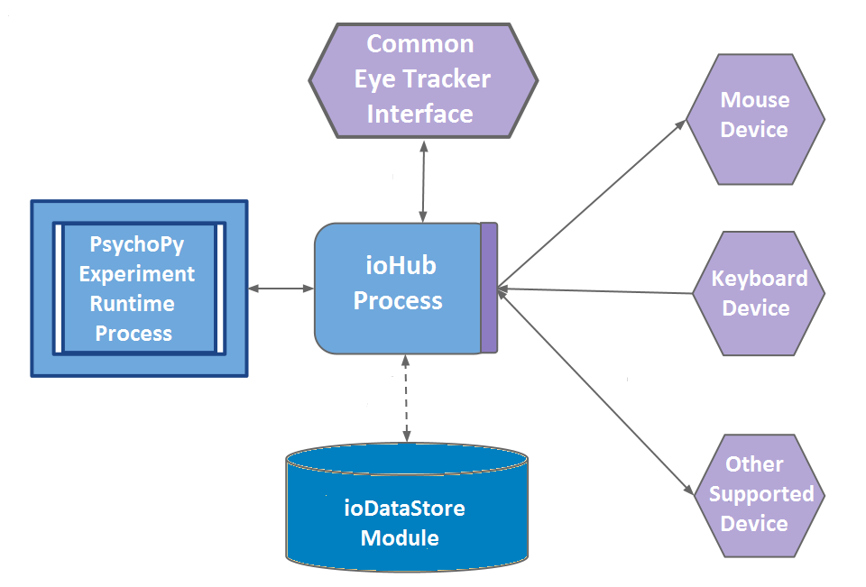

!SLIDE

# PsychoPy 6: Interface with Eye Trackers
   
    Created by Dr. Jibo He
    
    [mailto:hejibo@usee.tech](hejibo@usee.tech)

!SLIDE

### Table of Content
- Introduction to PsychoPy
- Introduction to Eye Trackers
- EyeTribe Eye Trackers
- Tobii Eye Trackers
- PsychoPy / ioHub Example Experiments
- Processing Eye Tracker Data Scripts
- Eye Tracker Data Visualization Scripts

!SLIDE left

# Introduction to PsychoPy
PsychoPy has very many stimulus types:

- **ImageStim** for bitmaps
    * used either as the image or as an alpha mask
- **GratingStim** 
    * use the image as a cyclic texture 
    * you can specify the spatial frequency of that texture
- **RadialStim** 
    * for radial patterns (e.g. retinotopy patches)
- **TextStim**
    * including choice of fonts and Unicode characters (but no real ‘formatting’)
- **DotStim** 
    * for random dot kinematograms with a variety of signal/noise methods
- **ElementArray** 
    * allows dynamic (hardware-optimised) presentation of similar-textured elements. e.g. create an array of gabors or a point-light walker
- **Shapes**
    * basic or custom vertices, filled or unfilled
- **RatingScale** 
    * OK this isn’t a stimulus exactly but it’s pretty handy
- **Sounds** 
    * either generated or stored in wav files

!SLIDE left

# Many inputs options:

* mouse, keyboard, joystick
* eyetrackers
* serial/parallel ports
    * anything that can communicate with your computer!
* microphone, including speech recognition by google!!

!SLIDE left

# ioHub

### PsychoPy.ioHub is a Python package providing a cross-platform device event monitoring and storage framework.

- ioHub is free to use and is GPL version 3 licensed.

- Support for the following operating Systems:
    * Windows XP SP3, 7, 8
    * Apple OS X 10.6+
    * Linux 2.6+

- Monitoring of events from computer _devices_ such as:
    * Keyboard
    * Mouse
    * Analog to Digital Converter
    * XInput compatible gamepads
    * Remote ioHub Server instances
    * Eye Trackers, via the ioHub Common Eye Tracking Interface

!SLIDE left
# ioHub diagram

!SLIDE left

# The ioHub Common Eye Tracker Interface

The Common Eye Tracking Interface provides the same user level Python API for all supported eye tracking hardware, meaning:

* The same experiment script can be run with any supported eye tracker hardware.
* The eye event types supported by an eye tracker implementation are saved using the same format regardless of eye tracker hardware.

!SLIDE left

# Currently Supported Eye Tracking Systems
* LC Technologies EyeGaze and EyeFollower models.
* SensoMotoric Instruments iViewX models.
* SR Research EyeLink models.
* Tobii Technologies Tobii models.

!SLIDE left

# Areas of Functionality
* Initializing the Eye Tracker / Setting the Device State.
* Performing Calibration / System Setup.
* Starting and Stopping of Data Recording.
* Sending Messages or Codes to an Eye Tracker.
* Accessing Eye Tracker Data During Recording.
* Accessing the Eye Tracker native time base.
* Synchronizing the ioHub time base with the Eye Tracker time base.

!SLIDE left
# ioDataStore - Saving Event Data
* saving large streams of eye-movement data 
* HDF5 standardised data format

What can be Stored
* All events from all monitored devices during an experiment runtime.
* Experiment meta-data (experiment name, code, description, version,...)
* Session meta-data (session code, any user defined session level variables)
* Experiment DV and IV information (generally saved on a trial by trial basis, but up to you)

!SLIDE left

# Starting the ioHub Server Process

There are three ways to create a PsychoPy experiment which uses the iohub process. All approaches ultimately give you access to an instance of the ioHubConnection Class for communication and control of the iohub server:

* Directly create a ioHubConnection Class instance.
* Use the psychopy.iohub.launchHubServer() function.
* Use the psychopy.iohub.client.ioHubExperimentRuntime, implementing the class’s run() method for your experiment’s starting python code.

!SLIDE left

# Starting the ioHub Server Process
An example python script is available at 
[workshop_materials_root]python_source/launchHubServer.py
~~~~{python}
# Python Source File Available in python_source/launchHubServer.py

from  psychopy.iohub import launchHubServer

"""
Start the ioHub Process using launchHubServer. When started with no key word arguements,
the ioHub Process is started with Display, Keyboard, Mouse, and Experiment devices created
using their default configurations.
"""
io=launchHubServer()

# get the keyboard device
#
keyboard=io.devices.keyboard

print "Press any Key to Stop the ioHub Service:"
print

# Remove any already collected keyboard events
#
keyboard.clearEvents()

while True:
    # Check for new keyboarsd events
    #
    kb_events=keyboard.getEvents()
    if kb_events:
        print "Keyboard Event(s) Detected: "
        print

        # print out each event received
        #
        for e in kb_events:
            print e
            print

        break
    io.wait(0.2)

# Stop the ioHub Process and Exit
io.quit()
~~~~

!SLIDE left

# Introduction to Eye Trackers

!SLIDE left

# Hardware requirement for EyeTribe Eye Trackers

!SLIDE left

# Software requirement for EyeTribe Eye Trackers

!SLIDE left

# Initialization with EyeTribe Eye Trackers

!SLIDE left

# Calibration for EyeTribe Eye Trackers

!SLIDE left

# References

